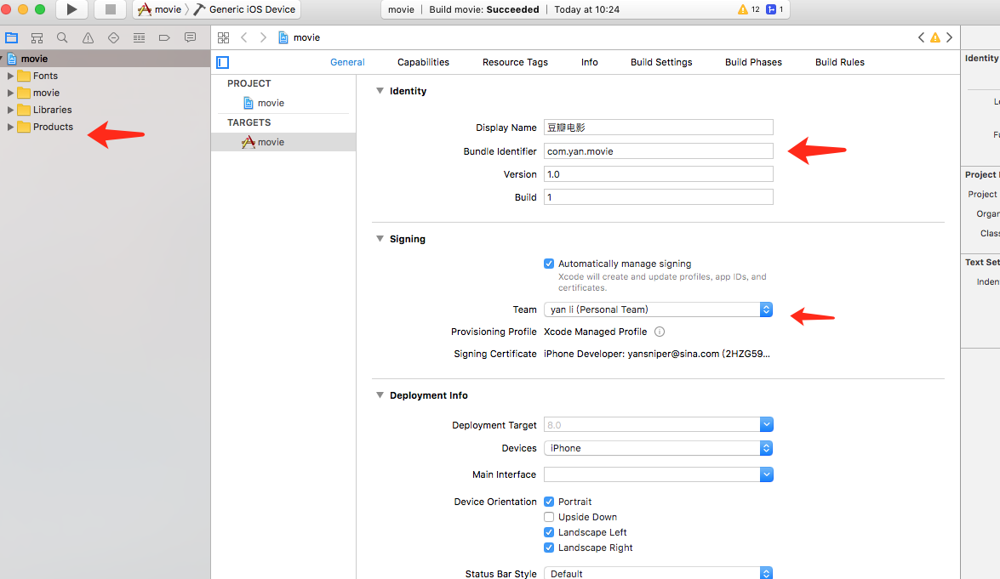

# movie
Douban movie app build by react-native ,using react-native + redux

## 下载

```
git clone git@github.com:sniperyan/movie.git
```

## 运行方法

安装依赖:

```
npm install
```

安卓运行:

```
react-native run-android
```

ios运行:

```
react-native run-ios
```

* 如果运行报错，请检查

1. `react-native-vector-icons`是否配置
1. `/android/app`下是否有`my-release-key.keystore`
1. 是不是用了cnpm安装依赖，换用npm就没问题（我在公司用的mac，回家用的windows，开始用的cnpm，报的奇葩的错误，换了npm就好了）
1. 再看看错误信息，自行查找解决方案，如果解决不了，可以提`issue`

## 说明

1. 豆瓣API参考 [https://developers.douban.com/wiki/?title=api_v2](https://developers.douban.com/wiki/?title=api_v2)
1. 开发过程中最好使用mock server，豆瓣的api有调用限制，频繁调用会被封ip，mock server地址[https://github.com/sniperyan/doubanMock](https://github.com/sniperyan/doubanMock)
1. 字体图标使用`react-native-vector-icons`，安卓和ios使用都需要配置，具体使用方法请参考官方文档[https://github.com/oblador/react-native-vector-icons](https://github.com/oblador/react-native-vector-icons)
1. 豆瓣的API有比较坑的地方，比如`/v2/movie/subject/`返回的数据里，directors和casts字段里avatars与id属性都可能为null值，所以需要特殊处理，见代码`src/components/FilmDetail.js`

## 开发总结

1. debug js remotely 看不到fetch的请求，mac下用charles抓包
1. debug js remotely 调试js时候，es6，es7语法是未编译的（目前还未发现类似react开发时候在webpack里配置sourceMap的方法），导致部分地方断点进不去，可以使用`console.log`输出关键信息
1. 写样式的时候，没有了chorme方便的样式调试工具，开始的时候非常不习惯也不好排错。可以给组件添加`backgroundColor`辅助检查，其实后来发现很多错误都是没有设置宽和高造成的，同时也可以用`show inspector`
1. 当年搞react时候的react dev tools 不能用了，非常的不爽
1. 适配手机屏幕，用`Dimensions.get('window').width`取到屏幕宽度，然后按比例算宽和高度
1. 不要看中文文档！不要看中文文档！不要看中文文档！重要的事情说3遍，直接看facebook的英文文档！


## run on iphone

1. 点击`movie.xcodeproj`文件，启动xcode
1. 在工程目录下，把movieTest目录删除
1. 添加signing team,修改bundle identifier,如图
1. 选中自己的iPhone，点击build按钮
1. build success之后，在手机 设置-通用-描述文件与设备管理-开发者应用 内选择信任应用

## 应用打包

1. ios app 需要688RMB买一个帐号才能上App Store，实在没钱就算了
1. 安卓利用gradle打包很简单，修改应用名称：`android\app\src\main\res\values\strings.xml`, `<string name="app_name">MyProject</string>`MyProject改成你需要的名字就好了。图标在android\app\src\main\res文件夹下每个mipmap开头的文件夹下有一个不同尺寸的版本，可以自行输出


## 运行效果

ios:


android:


